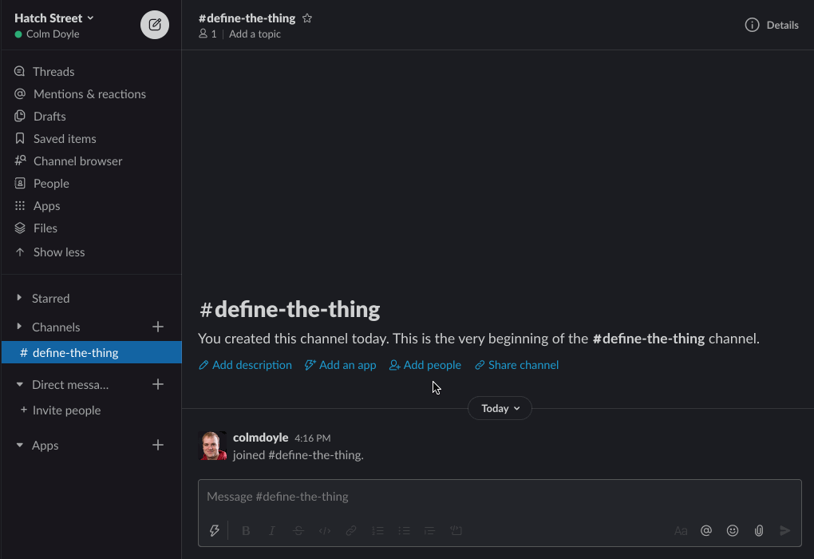
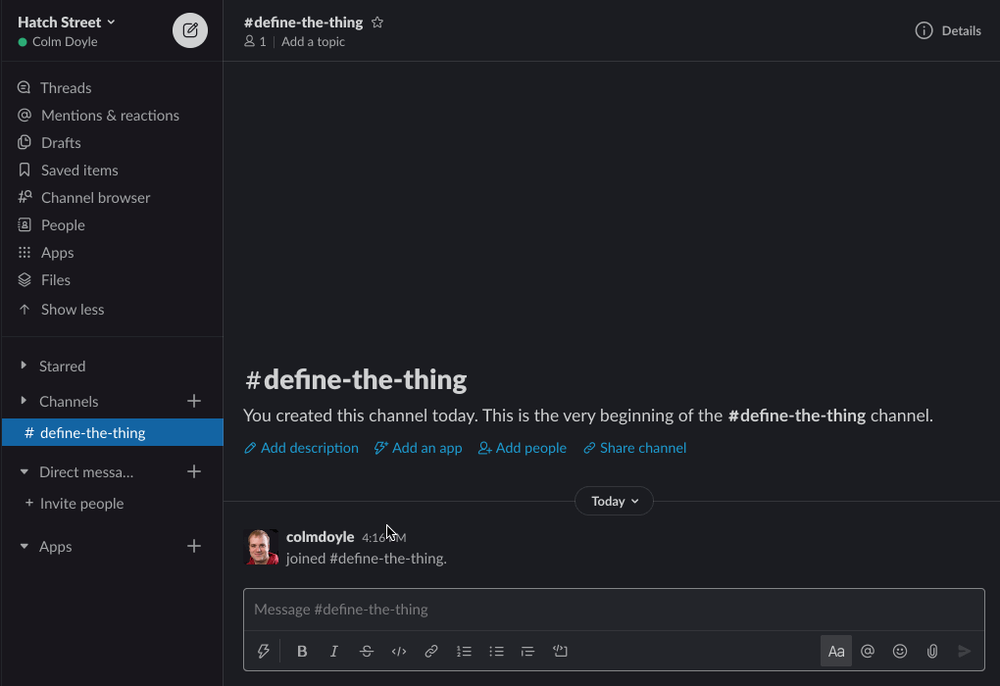

# Definition App

An app for storing and accessing company specific phrases

## Screenshots

_Searching definitions_

---

_Adding definitions_

## Installation

### A note of caution!

Whilst Definition implements the Slack oAuth flow, this is purely to support Enterprise Grid Installations. You should *not* install it on multiple public workspaces as the code does *not* make a distinction between workspaces when retrieving terms. Any user can access *any* term/definition pair in the system.

### Instructions
[Click here](docs/SETUP.md) for a step by step guide.

## Other implmentations

If TypeScript isn't your preferred language, here are other open source projects that implement similar functionality, built by community developers.

### Python
- [Whatis](https://github.com/wooddar/whatis)